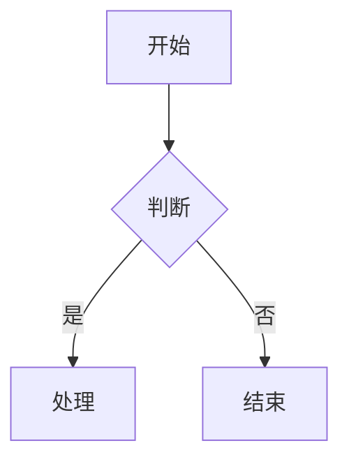
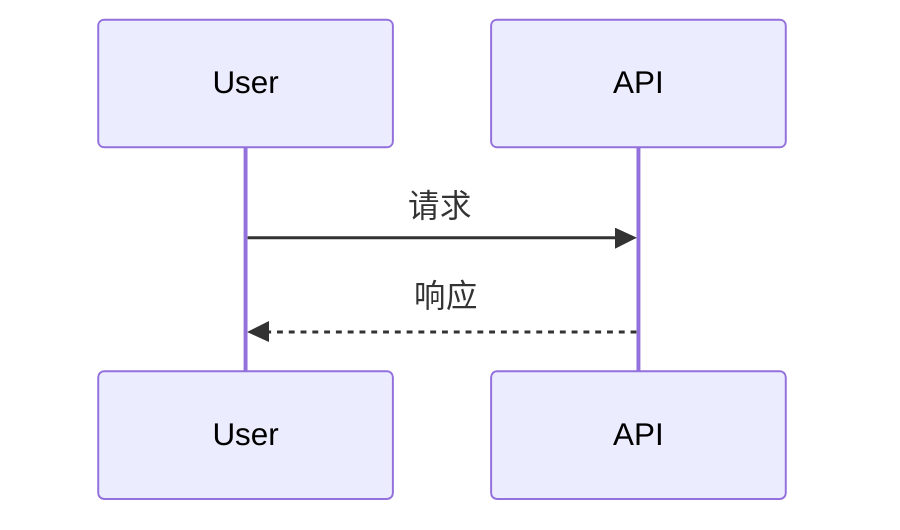
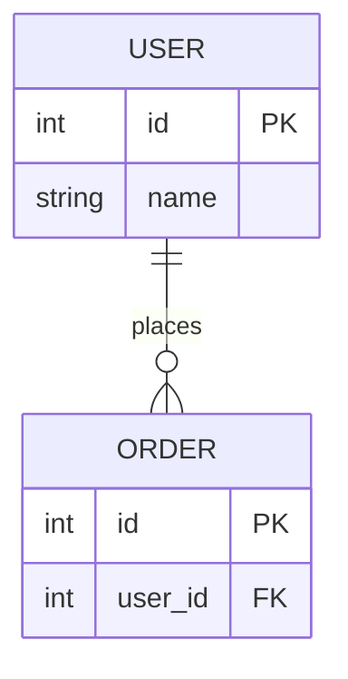
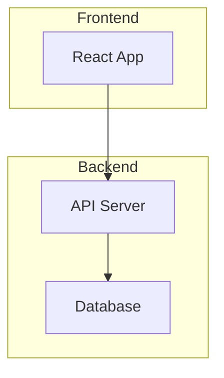

# 图表生成器

## 用途
使用文本生成各种开发图表，适用于架构文档、技术方案设计等场景。

## 支持的图表类型

### Mermaid
```

```mermaid
graph TD
    A[开始] --> B{判断}
    B -->|是| C[处理]
    B -->|否| D[结束]
```
```

### 时序图
```

```mermaid
sequenceDiagram
    participant User
    participant API
    User->>API: 请求
    API-->>User: 响应
```
```

### ER 图
```

```mermaid
erDiagram
    USER ||--o{ ORDER : places
    USER {
        int id PK
        string name
    }
    ORDER {
        int id PK
        int user_id FK
    }
```
```

### 架构图
```

```mermaid
graph TB
    subgraph Frontend
        A[React App]
    end
    subgraph Backend
        B[API Server]
        C[Database]
    end
    A --> B
    B --> C
```
```
